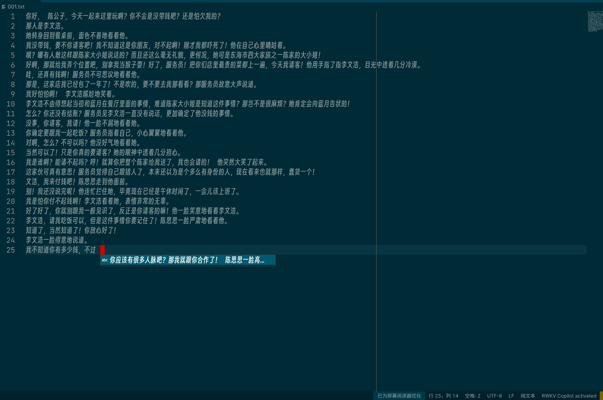

### Main function
When you use txt file to write a novel, use RWKG for content prompt.

### The project where the api interface is located
[link](https://github.com/Tlntin/ChatRWKV-Novel-api)

### chatRWKV project introduction
[link](https://github.com/BlinkDL/ChatRWKV)

### Screenshot

